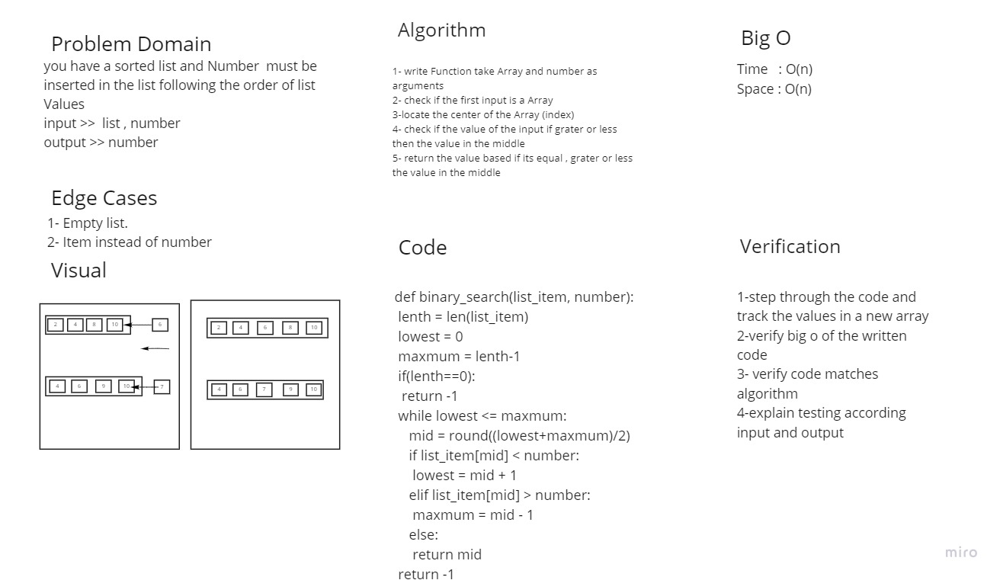

# Array Binary Search
### Write a function called BinarySearch which takes in 2 parameters: a sorted array and the search key. Without utilizing any of the built-in methods available to your language, return the index of the array’s element that is equal to the value of the search key, or -1 if the element is not in the array

## Approach & Efficiency
### for the approach, i created a function that takes two inputs, one is an array, and the other is any value, then returned a the index of the number if it in the Array and -1 if it not

### time => from the shifting procedure it should loop over half of the array length, it gives an O(N)

### space => the stored values are inside an array, and this array is O(n) 