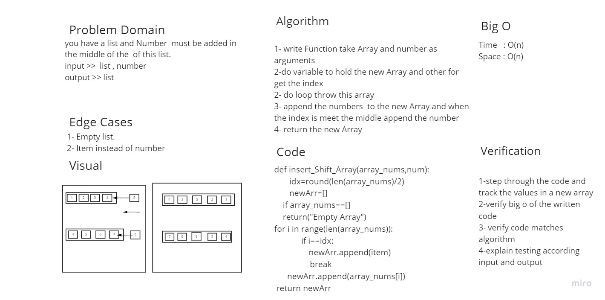

# Reverse an Array
### Write a function called insertShiftArray which takes an array and a variable as inputs. Without utilizing any of the built-in methods available to your language, return an array with the element inserted at the array's center

## Approach & Efficiency
### for the approach, i created a function that takes two inputs, one is an array, and the other is any value, then returned a new array with the value inserted at the array's middle index

## Big O:

### time => from the shifting procedure it should loop over half of the array length, it gives an O(N)

### space => the stored values are inside an array, and this array is O(n) 