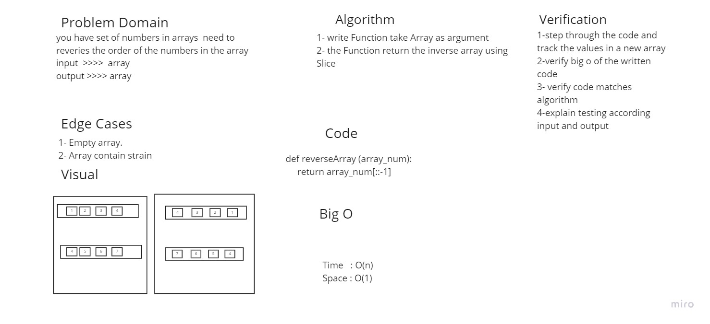

# Reverse an Array
## Write a function called reverseArray which takes an array as an argument. Without utilizing any of the built-in methods available to your language, return an array with elements in reversed order

## Approach & Efficiency

 ### For the approach I made function thet takes array contain numbers then  Loop throw the arrar and append the values to new array based on the index inversely  
 ### Big O:
 ### time => from the for loop with no nested loops or any other major effect, it gives an O(N)
 ### space => the stored values are inside an array, and this array is O(N) because the array's lingth depends on the for loop inputs