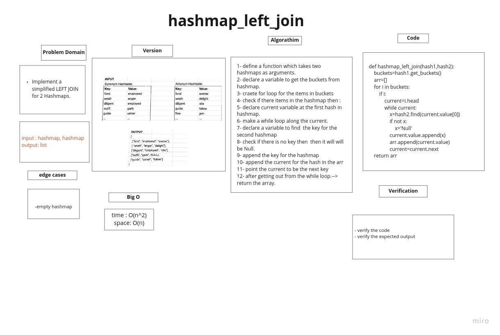

# Hashmap LEFT JOIN

The Hashmap LEFT JOIN returns an array that contains all the keys and the values from the left has table, with the values for the right hash tables if they have the same key

## Challenge

Write a function called left join, that takes two hash maps as an input, and returns an array that has the keys and values for the left hashmap, and the values from the right hashmap if they have the same key

## Whiteboard



## Approach & Efficiency

for tha approach taken, i used a new hash table and an array, for the new hash table, i stored the keys as the keys from the left hash table, and the values as an array with two elements, the first one is the value for the key in the left hash table, and the second one is either a NULL if the key does not exist inside the second hash table, or the value if it exists. then, i used a for loop for the keys inside the new hash table, in order to get all the keys and the values, store them inside the array and return the array.


time complexity: the time complexity is O(n), we have a for loop inside the function.

space complexity: the space complexity for the function is also O(n), we have an array depending on the output of a for loop.

## Solution


```


def hashmap_left_join(hash1,hash2):

    '''
    Return list of lists with word , synonym and antonyms

    Function loops inside first hashtable buckets,
    and check if the words has antonyms in the Second hashtable 


    Parameters : Hashtable
     hash1: Hashtable
     hash2: Hashtable


    Return : List of strings =>  [ [Word,synonym,antonyms], [Word,synonym,antonyms]]

    '''
    buckets=hash1.get_buckets()
    arr=[]
    for i in buckets:
        if i:
            current=i.head
            while current:
                x=hash2.find(current.value[0])
                if not x:
                    x='Null'
                current.value.append(x)
                arr.append(current.value)
                current=current.next
    return arr


```