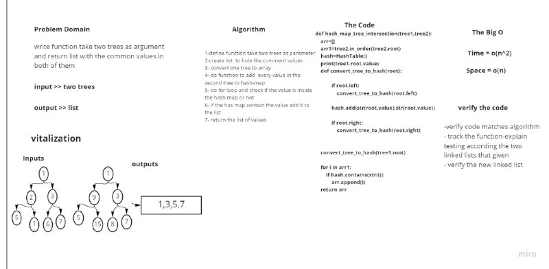

# Challenge Summary

write a function that takes two binary trees as an input and returns an array that contains all the values found to be in the 2 binary trees

## Whiteboard Process



## Approach & Efficiency

we define function take two trees as parameter, and create list  to hole the comment values,firstly convert one tree to array then define function to add  every value in the second tree to hash-map , loop through list and check if the value is inside the hash map or not.if the has map contain the value add it to the list in the end  return the list of values.

for the big O, the space complexity is O(n), because we are using an array to store the values inside it, and for the time complexity, it's also and O(n^2) because we loop through list two times .

## Solution


```

def hash_map_tree_intersection(tree1,tree2):
    arr=[]
    # arr=tree1.in_order(tree1.root)
    print(tree1.root)
    arr1=tree2.in_order(tree2.root)
    # print(arr)
    hash=HashTable()
    print(tree1.root.value)
    def convert_tree_to_hash(root):

            if root.left:
                convert_tree_to_hash(root.left)

            hash.add(str(root.value),str(root.value))
            print("x")

            if root.right:
                convert_tree_to_hash(root.right)


    convert_tree_to_hash(tree1.root)

    for i in arr1:
        if hash.contains(str(i)):
            arr.append(i)
    return arr


```