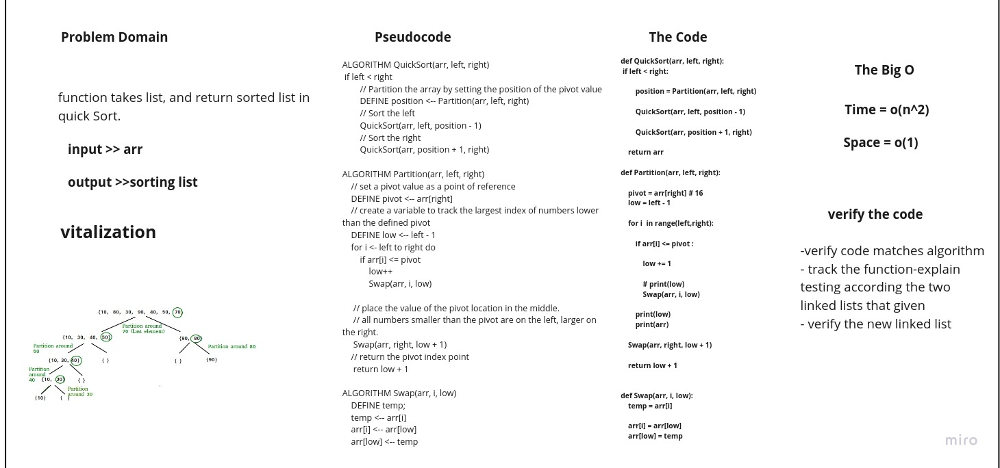

# Merge Sort
# Challenge Summary
Create function take an array as argument than sort it in quick Sort.

## Whiteboard Process

## Approach & Efficiency

+ selecting the pivot to be the the last element of the array,
+ sorting the values so the values on the left of the pivot would be the values smaller
+ the values on the right would be larger
+ we would determine specifically where is the pivot located
+ deal with the pivot's right elements and left elements separately by calling the function recursively
+ setting pivots and sorting arrays, at the end, we just combine every array back together to form a sorted ar