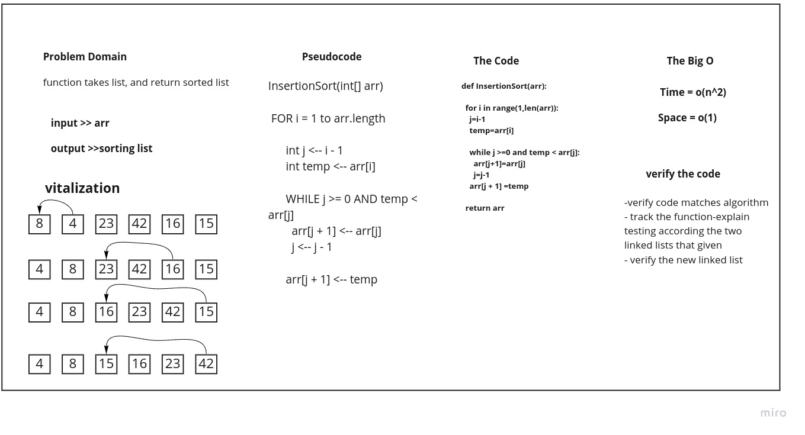

# Challenge Summary
Create function take an array as argument than sort it in quick Sort.

## Whiteboard Process

## Approach & Efficiency

+ Ceate function take array of numbers as arg
+ declear n equal the length of array
+ let mid half of n
+ let left the first half and right the seconde half
+ clal the function again with left and right
+ after that create new function called merge take three argument left, right and the orgnal array
+ call merge with the left, right and array

## Solution
~~~

def  mergesort(arr):
    n=len(arr)

    if n > 1:
       mid =int(n/2)
       left =arr[0:mid]
       right =arr[mid:n]
    #    sort the left side
       mergesort(left)
    #    sort the right side
       mergesort(right)
    #    merge the sorted left and right sides together
       merge(left, right, arr)

def merge(left, right, arr):
     i =0
     j =0
     k =0

     while i < len(left) and j < len(right):
         if left[i] <= right[j]:
            arr[k] =left[i]
            i =i + 1
         else:
            arr[k] =right[j]
            j =j + 1

         k =k + 1

     if i == len(left):
            arr[k]=right[j]
     else:
            arr[k]=left[i]

~~~
