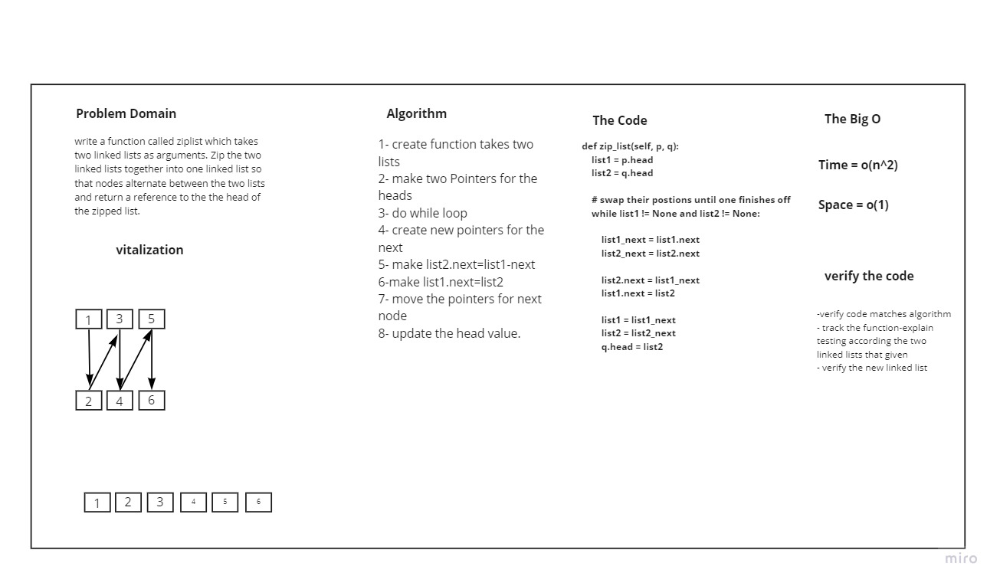

# Linked List Zip


##  Challenge Summary
write a function called ziplist which takes
two linked lists as arguments. Zip the two linked lists together into one linked list so that nodes alternate between the two lists and return a reference to the the head of the zipped list.

## Whiteboard Process


## Approach & Efficiency
I made to trile The first one I made Four variable for head and next for the first list , the Same for the seconed one it returen correct value for the first 4 numbers but not for the rest, 
then I do with this way explaind in the Solution section 

## Solution
```
  list1 = p.head
        list2 = q.head
 
        # swap their postions until one finishes off
        while list1 != None and list2 != None:
 
            list1_next = list1.next
            list2_next = list2.next
 
            list2.next = list1_next  
            list1.next = list2 
 
            list1 = list1_next
            list2 = list2_next
            q.head = list2

```
