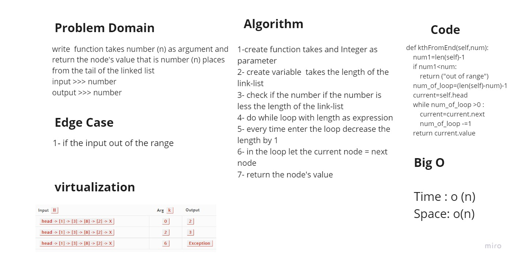

# linked-list-kth
##  Challenge Summary
Like arrays, Linked List is a linear data structure. Unlike arrays, linked list elements are not stored at a contiguous location; the elements are linked using pointers.

##  Challenge Summary
write a function called ziplist which takes
two linked lists as arguments. Zip the two linked lists together into one linked list so that nodes alternate between the two lists and return a reference to the the head of the zipped list.

## Whiteboard Process


## Approach & Efficiency

I made to trile The first one I made Four variable for head and next for the first list , the Same for the seconed one it returen correct value for the first 4 numbers but not for the rest, 
then I do with this way explaind in the Solution section 

## Solution
```
  
  def kthFromEnd(self,num):
      num1=len(self)-1
      if num1<num:
          return ("out of range")
      num_of_loop=(len(self)-num)-1
      current=self.head
      while num_of_loop >0 :
        #   print(num_of_loop)
          current=current.next
          num_of_loop -=1
      return current.value


```


## The Link-list Project Includes  

+ Insert method  for when the user wants to insert a value at the beginning of the Linked list.

+ Append Method  for append node at last of the Link list.

+ the str method prints a string containing all the elements inside the linked list in an organized matter.

+ include method checks if the value is in the linked list or not

+ insertAfter method to insert a value after a certain node, if exists

+ insertBefore method to insert a value before a certain node, if exists

+ kthFromEnd method is to look up for a node value, starting from the end
