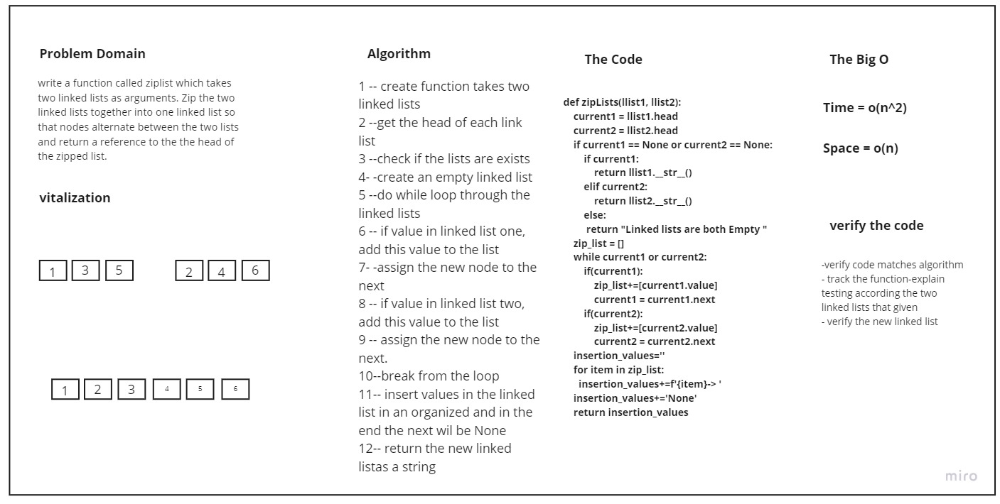

# Linked List Zip


##  Challenge Summary
write a function called ziplist which takes
two linked lists as arguments. Zip the two linked lists together into one linked list so that nodes alternate between the two lists and return a reference to the the head of the zipped list.

## Whiteboard Process


## Approach & Efficiency
I made to trile The first one I made Four variable for head and next for the first list , the Same for the seconed one it returen correct value for the first 4 numbers but not for the rest, 
then I do with this way explaind in the Solution section 
## Solution
```
def zipLists(list1, list2):
    current1 = list1.head
    current2 = list2.head
    if current1 == None or current2 == None:
        if current1:
            return list1.__str__()
        elif current2:
            return list2.__str__()
        else:
         return "Linked lists are both Empty "
    zip_list = []
    while current1 or current2:
        if(current1):
            zip_list+=[current1.value]
            current1 = current1.next
        if(current2):
            zip_list+=[current2.value]
            current2 = current2.next
    insertion_values=''
    for item in zip_list:
      insertion_values+=f'{item}-> '
    insertion_values+='None'
    return insertion_values

```


## The Link-list Project Includes  

+ Insert method  for when the user wants to insert a value at the beginning of the Linked list.

+ Append Method  for append node at last of the Link list.

+ the str method prints a string containing all the elements inside the linked list in an organized matter.

+ include method checks if the value is in the linked list or not

+ insertAfter method to insert a value after a certain node, if exists

+ insertBefore method to insert a value before a certain node, if exists

+ kthFromEnd method is to look up for a node value, starting from the end
