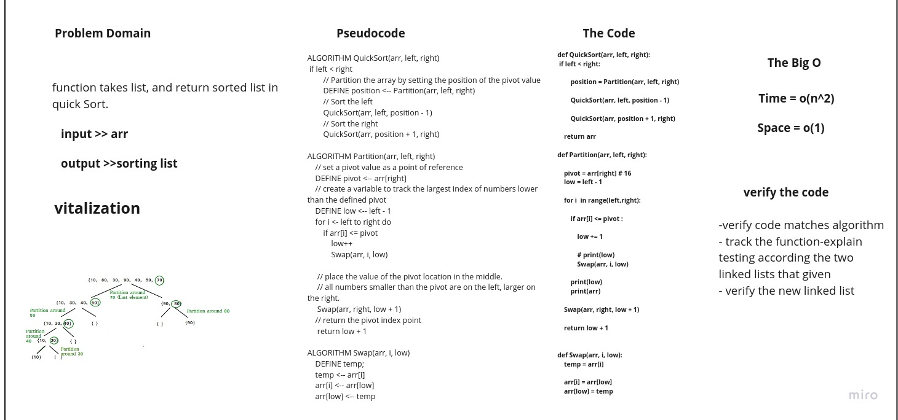

# Challenge Summary
Create function take an array as argument than sort it in quick Sort.

## Whiteboard Process

## Approach & Efficiency

+ selecting the pivot to be the the last element of the array,
+ sorting the values so the values on the left of the pivot would be the values smaller
+ the values on the right would be larger
+ we would determine specifically where is the pivot located
+ deal with the pivot's right elements and left elements separately by calling the function recursively
+ setting pivots and sorting arrays, at the end, we just combine every array back together to form a sorted array

## Solution
~~~

def QuickSort(arr, left, right): 
    if left < right:

        position = Partition(arr, left, right)

        QuickSort(arr, left, position - 1)

        QuickSort(arr, position + 1, right)

     

def Partition(arr, left, right):

    pivot = arr[right] # 16 
    low = left - 1

    for i  in range(left,right):
        
        if arr[i] <= pivot :

            low += 1
            
            # print(low)
            Swap(arr, i, low)

        print(low)
        print(arr)
        
    Swap(arr, right, low + 1)

    return low + 1

    
def Swap(arr, i, low):
    temp = arr[i]

    arr[i] = arr[low]
    arr[low] = temp

~~~
