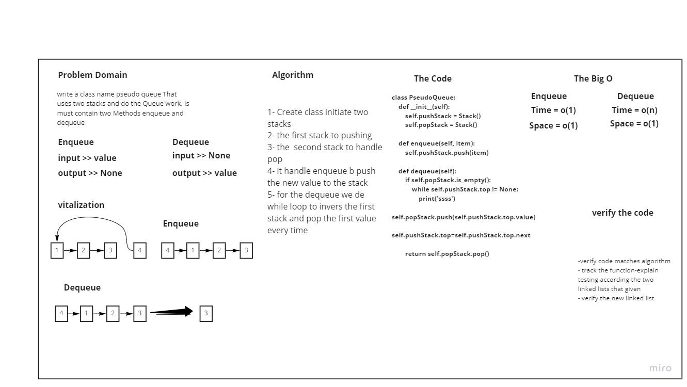

# Stacks and Queues
### Create a brand new PseudoQueue class. Do not use an existing Queue. Instead, this PseudoQueue class will implement our standard queue interface (the two methods listed below), but will internally only utilize 2 Stack objects. Ensure that you create your class with the following methods:

+ enqueue(value) which inserts value into the PseudoQueue, using a first-in, first-out approach.

+ dequeue() which extracts a value from the PseudoQueue, using a first-in, first-out approach.

## Whiteboard Process


## Approach & Efficiency

i started with creating a class called PseudoQueue, that takes two stacks as an input, to create a proper pushStack and popStack to the Queue. then i came up with two solutions for this code challenge, one with using push and pop methods from stack class, and one without it, i think that they both are efficient for such a situation.

## Solution
```

class PseudoQueue:
    def __init__(self):
        self.pushStack = Stack()
        self.popStack = Stack()

    def enqueue(self, item):
        self.pushStack.push(item)

    def dequeue(self):
        if self.popStack.is_empty():
            while self.pushStack.top != None:
                print('ssss')
                self.popStack.push(self.pushStack.top.value)
                self.pushStack.top=self.pushStack.top.next
            
        return self.popStack.pop()
             

```
